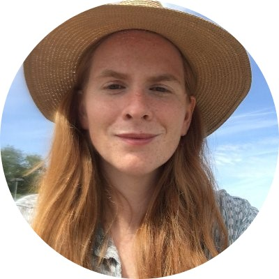

```{r setup, include=FALSE}
knitr::opts_chunk$set(echo = FALSE)
```

# Dr. Denis Valle (drvalle@ufl.edu)

Denis is a quantitative scientist broadly interested in problems in developing countries and Bayesian models. His work has focused predominantly in developing next-generation models for highly multivariate biodiversity data (e.g., the Latent Dirichlet Allocation model), determining the impact of large-scale anthropogenic stressors in the Amazon region (e.g., using copula models to quantify the hydrological impact of large dams), and developing models and decision support tools for malaria epidemiology.

# Lyndsie Wszola (lyndsie.wszola@huskers.unl.edu)
 

Lyndsie is a PhD student in the School of Biological Sciences and School of Natural Resources at the University of Nebraska Lincoln. Lyndsie's work leverages large-scale fish and wildlife agency datasets to understand changing social and ecological dynamics of freshwater fisheries.

# Chad Palmer
